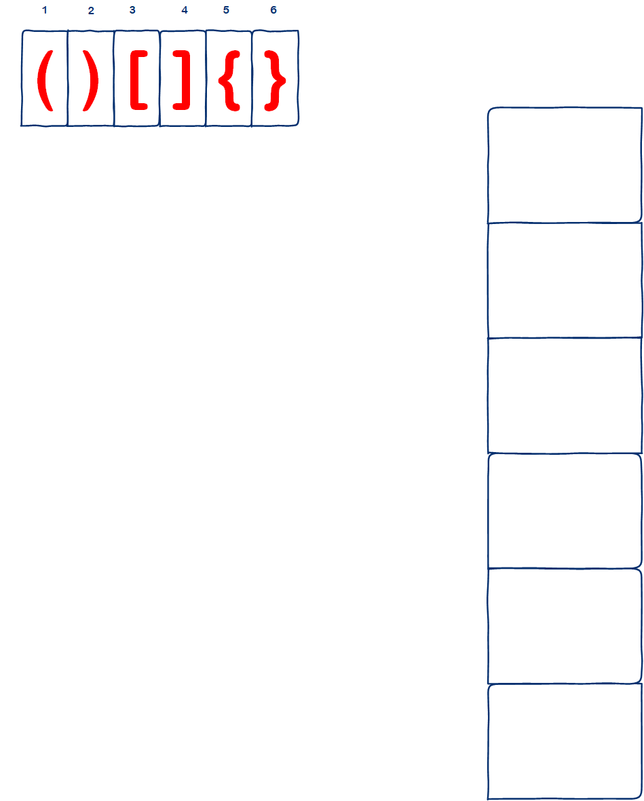
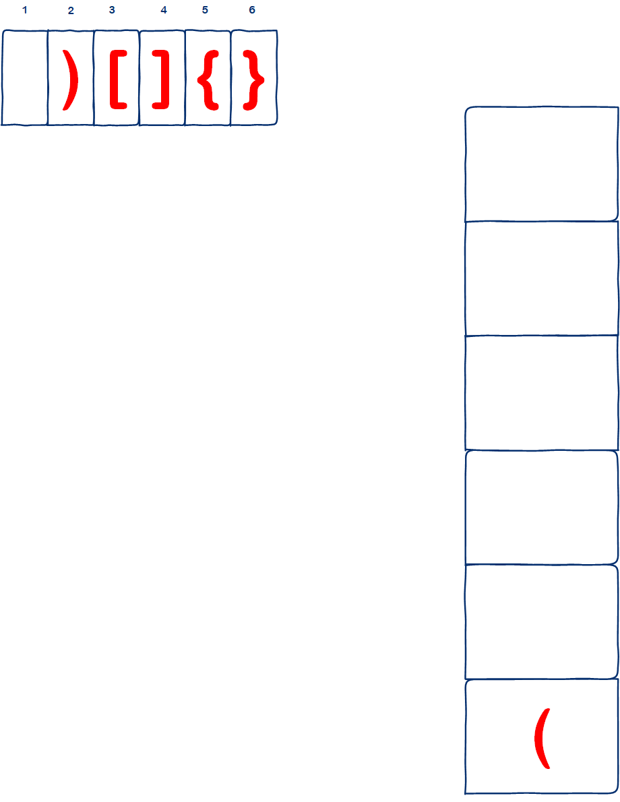
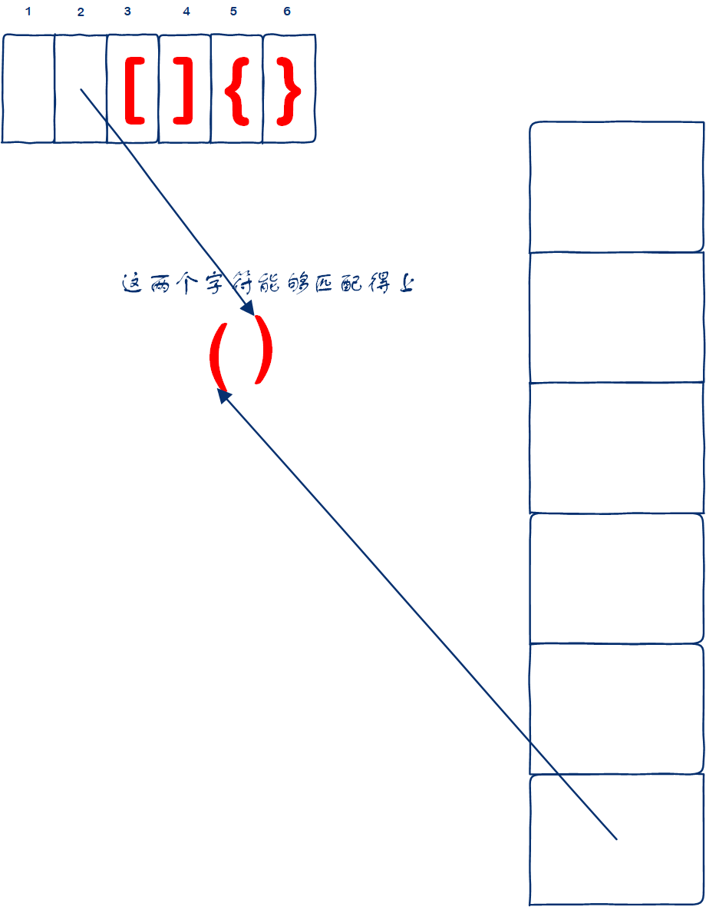
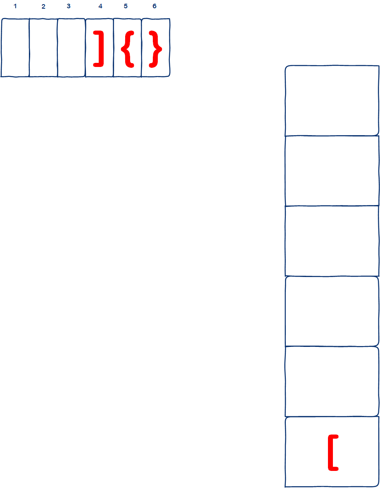
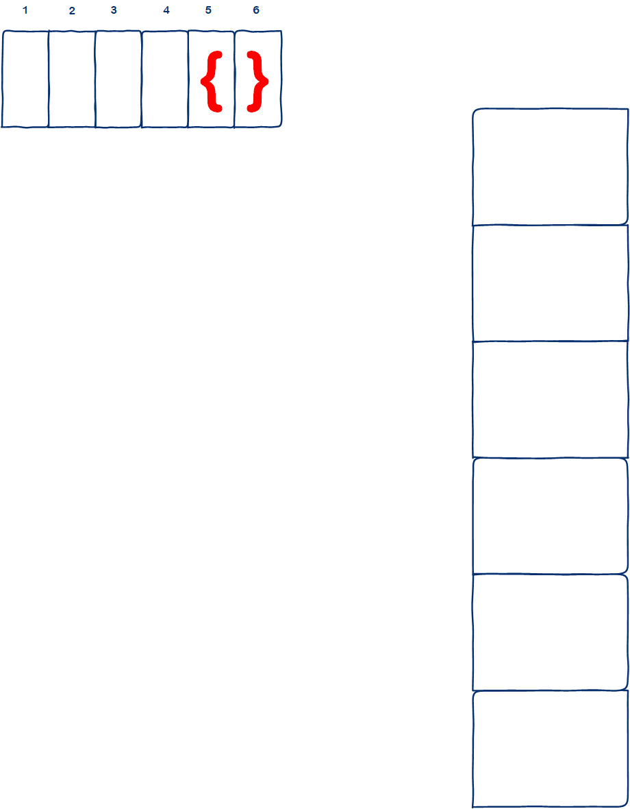
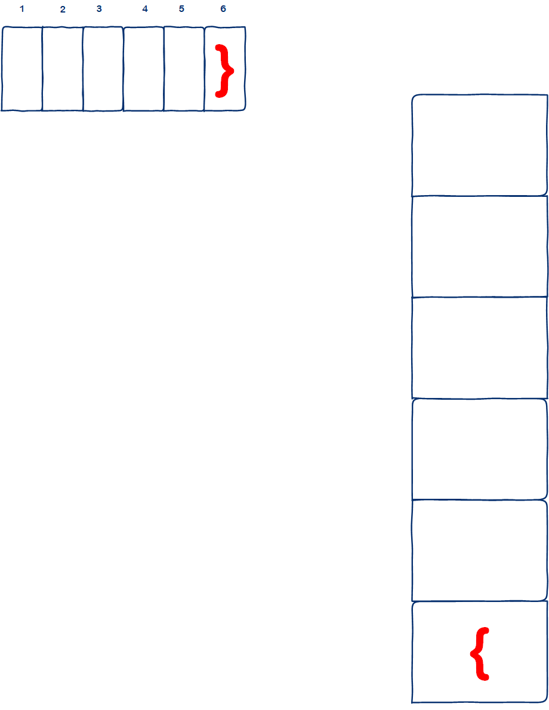
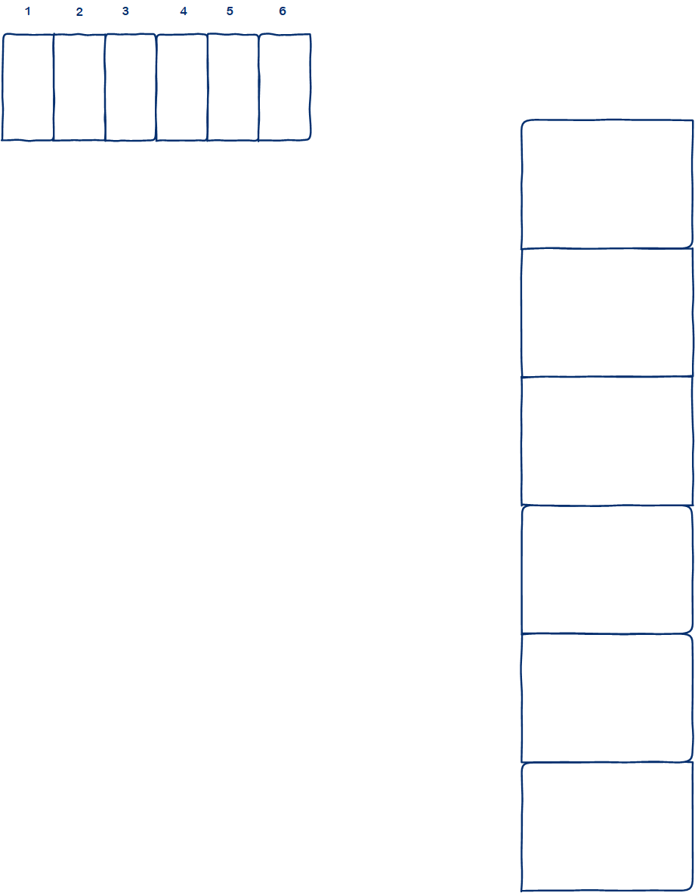

# 20. 有效的括号

# 一、题目描述

题目链接： 

```
https://leetcode.cn/problems/valid-parentheses/description/
```

给定一个只包括 `'('`，`')'`，`'{'`，`'}'`，`'['`，`']'` 的字符串 `s` ，判断字符串是否有效。

有效字符串需满足：

1. 左括号必须用相同类型的右括号闭合。
2. 左括号必须以正确的顺序闭合。
3. 每个右括号都有一个对应的相同类型的左括号。 

**示例 1：**

```
输入：s = "()"
输出：true
```

**示例 2：**

```
输入：s = "()[]{}"
输出：true
```

**示例 3：**

```
输入：s = "(]"
输出：false
```

 **提示：**

- `1 <= s.length <= 104`
- `s` 仅由括号 `'()[]{}'` 组成

# 二、思路分析

因为是要求括号成对出现的，适合这种场景的是栈匹配，遇到开括号的时候就进栈，遇到闭括号的时候就出栈，只是需要注意的是字符串匹配完的时候记得判断下栈中是否还有没有匹配完的括号。

下面让我们来模拟一个实际的例子，假设现在要检查的字符串是`()[]{}`，则当前是这样子的：



首先看第一个位置的`(`字符，它是一个开括号，则将其入栈：



然后再看第二个位置的`)`字符，它是一个闭括号，则将当前栈顶的字符`(`出栈，栈顶的字符`(`能够与`)`组成一对括号，所以它俩抵消掉了：



则继续看第3个位置上的字符，是`[`，因为是个开括号，则将其入栈：



继续看第四个字符`]`，是个闭括号，则将栈顶的字符`]`出栈，而`]`刚好和`[`能够匹配上，所以它俩也互相抵消了：



继续看第5个字符`{`，是开括号，则将其入栈：



然后看第6个字符`}`，是闭括号，则将栈顶的字符出栈，它俩也互相抵消掉了，至此，所有的字符被消费完毕，同时栈也是空的，说明被检查的字符串是有效的括号字符串：




# 三、AC代码

## 3.1 Golang

```go
func isValid(s string) bool {
    stack := make([]rune, 0)
    for _, c := range s {
        // 左括号入栈 
        if c == '(' || c == '{' || c == '['{
            stack = append(stack, c)
        } else if c == ')' || c == ']' || c == '}' {
            // 右括号的话就跟栈中的进行匹配 
            if len(stack) == 0 {
                return false 
            }
            excepted := stack[len(stack)-1]
            stack = stack[0:len(stack)-1]
            if (c == '}' && excepted != '{') || (c == ')' && excepted != '(') || (c == ']' && excepted != '[') {
                return false 
            }
        }
    }
    // 栈中是否仍然有没有匹配完的字符 
    return len(stack) == 0 
}
```

## 3.2 Java

```java

```


