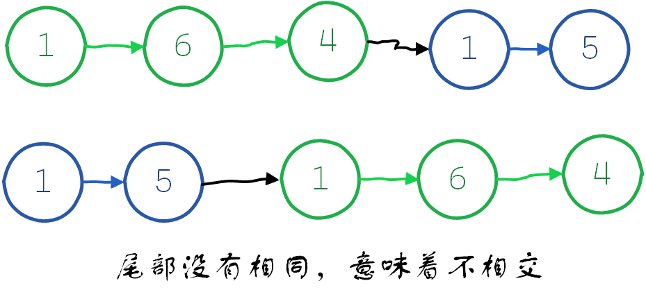

# 160. 相交链表

# 一、题目描述

题目链接： 

```
https://leetcode.cn/problems/intersection-of-two-linked-lists/description/
```


给你两个单链表的头节点 `headA` 和 `headB` ，请你找出并返回两个单链表相交的起始节点。如果两个链表不存在相交节点，返回 `null` 。

图示两个链表在节点 `c1` 开始相交**：**

[](https://assets.leetcode-cn.com/aliyun-lc-upload/uploads/2018/12/14/160_statement.png)

题目数据 **保证** 整个链式结构中不存在环。

**注意**，函数返回结果后，链表必须 **保持其原始结构** 。

**自定义评测：**

**评测系统** 的输入如下（你设计的程序 **不适用** 此输入）：

- `intersectVal` - 相交的起始节点的值。如果不存在相交节点，这一值为 `0`
- `listA` - 第一个链表
- `listB` - 第二个链表
- `skipA` - 在 `listA` 中（从头节点开始）跳到交叉节点的节点数
- `skipB` - 在 `listB` 中（从头节点开始）跳到交叉节点的节点数

评测系统将根据这些输入创建链式数据结构，并将两个头节点 `headA` 和 `headB` 传递给你的程序。如果程序能够正确返回相交节点，那么你的解决方案将被 **视作正确答案** 。

 

**示例 1：**

[](https://assets.leetcode.com/uploads/2018/12/13/160_example_1.png)

```
输入：intersectVal = 8, listA = [4,1,8,4,5], listB = [5,6,1,8,4,5], skipA = 2, skipB = 3
输出：Intersected at '8'
解释：相交节点的值为 8 （注意，如果两个链表相交则不能为 0）。
从各自的表头开始算起，链表 A 为 [4,1,8,4,5]，链表 B 为 [5,6,1,8,4,5]。
在 A 中，相交节点前有 2 个节点；在 B 中，相交节点前有 3 个节点。
— 请注意相交节点的值不为 1，因为在链表 A 和链表 B 之中值为 1 的节点 (A 中第二个节点和 B 中第三个节点) 是不同的节点。换句话说，它们在内存中指向两个不同的位置，而链表 A 和链表 B 中值为 8 的节点 (A 中第三个节点，B 中第四个节点) 在内存中指向相同的位置。
```

 

**示例 2：**

[](https://assets.leetcode.com/uploads/2018/12/13/160_example_2.png)

```
输入：intersectVal = 2, listA = [1,9,1,2,4], listB = [3,2,4], skipA = 3, skipB = 1
输出：Intersected at '2'
解释：相交节点的值为 2 （注意，如果两个链表相交则不能为 0）。
从各自的表头开始算起，链表 A 为 [1,9,1,2,4]，链表 B 为 [3,2,4]。
在 A 中，相交节点前有 3 个节点；在 B 中，相交节点前有 1 个节点。
```

**示例 3：**

[](https://assets.leetcode.com/uploads/2018/12/13/160_example_3.png)

```
输入：intersectVal = 0, listA = [2,6,4], listB = [1,5], skipA = 3, skipB = 2
输出：null
解释：从各自的表头开始算起，链表 A 为 [2,6,4]，链表 B 为 [1,5]。
由于这两个链表不相交，所以 intersectVal 必须为 0，而 skipA 和 skipB 可以是任意值。
这两个链表不相交，因此返回 null 。
```

 

**提示：**

- `listA` 中节点数目为 `m`
- `listB` 中节点数目为 `n`
- `1 <= m, n <= 3 * 104`
- `1 <= Node.val <= 105`
- `0 <= skipA <= m`
- `0 <= skipB <= n`
- 如果 `listA` 和 `listB` 没有交点，`intersectVal` 为 `0`
- 如果 `listA` 和 `listB` 有交点，`intersectVal == listA[skipA] == listB[skipB]`

 

**进阶：**你能否设计一个时间复杂度 `O(m + n)` 、仅用 `O(1)` 内存的解决方案？


# 二、思路

先把尾部对齐，然后再进行比较，但是时间复杂度是`O(n) + O(m) + O(max(n, m))`： 

比如原始的链表是这个样子，这是两个相交链表，它们从c1节点开始相交，从这个节点一直到结束都是相同的，所以画图时从c1节点就省略合并为一条了：


现在为了更直观的理解，让我们把这两个相交链表还原为两个单独的链表来表示，为了比较方便区分，我们再这两条链表不同的颜色来表示：


然后我们把第一个链表后面追加第二个链表，第二个链表后面追加第一个链表，这样我们能够得到两个一样长的链表，注意这一步是为了把两个链表的尾部对齐，因为如果两个链表相交，它们的尾部一定是从某个节点开始相等的，因此我们只需要想办法对齐尾部，然后从头遍历找到第一个相同的元素就可以了，从这个元素往后都是相同的，而如果遍历完还没找到相同的节点则是两个链表不相交： 


比如上面给出的示例 1测试用例（注意红框处没有包含1不是笔误，是因为题目说这两个1的地址不同并不是同一个），这两个链表从节点8开始相交，最后三个节点是相同的：


示例2的数据样例从节点2相交，最后两个节点是相同的：


示例3给出的示例数据中的两个链表不相交：




# 三、AC代码

## 3.1 Golang

```go
/**
 * Definition for singly-linked list.
 * type ListNode struct {
 *     Val int
 *     Next *ListNode
 * }
 */
func getIntersectionNode(headA, headB *ListNode) *ListNode {

    // 朴素的想法，先将两个链表从尾部对齐，然后再比较 

    lengthA := 0 
    tempHeadA := headA 
    for tempHeadA != nil {
        lengthA++ 
        tempHeadA = tempHeadA.Next 
    }

    lengthB := 0 
    tempHeadB := headB 
    for tempHeadB != nil {
        lengthB++ 
        tempHeadB = tempHeadB.Next 
    }

    if lengthA > lengthB {
        for i:=lengthA-lengthB; i>0 && headA!=nil; i-- {
            headA = headA.Next 
        }
    } else {
        for i:=lengthB-lengthA; i>0 && headB!=nil; i-- {
            headB = headB.Next 
        }
    }

    for headA != nil && headB != nil {
        if headA == headB {
            return headA 
        }
        headA = headA.Next 
        headB = headB.Next 
    }
    return nil  
}
```


更优解，互相交换啥的....


