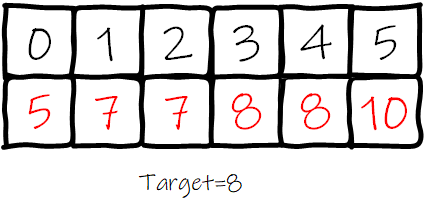
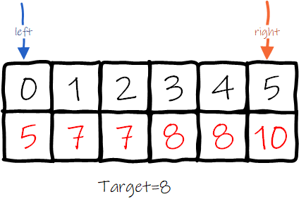
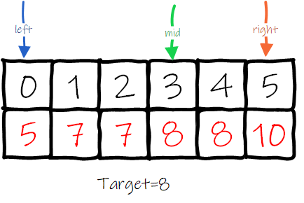
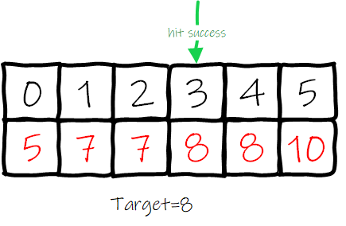
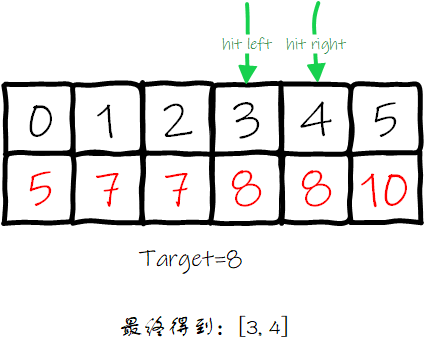
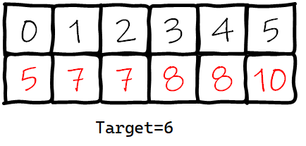
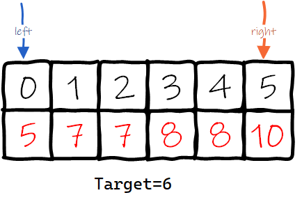
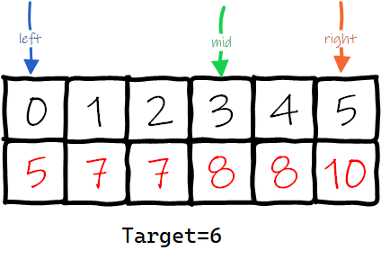
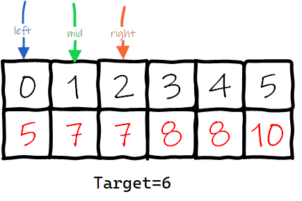
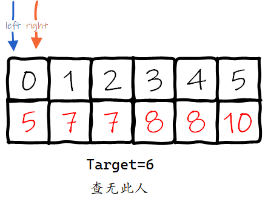

# 34. 在排序数组中查找元素的第一个和最后一个位置

# 一、题目描述

题目链接：

```
https://leetcode.cn/problems/find-first-and-last-position-of-element-in-sorted-array/description/
```


给你一个按照非递减顺序排列的整数数组 `nums`，和一个目标值 `target`。请你找出给定目标值在数组中的开始位置和结束位置。

如果数组中不存在目标值 `target`，返回 `[-1, -1]`。

你必须设计并实现时间复杂度为 `O(log n)` 的算法解决此问题。

 

**示例 1：**

```
输入：nums = [5,7,7,8,8,10], target = 8
输出：[3,4]
```

**示例 2：**

```
输入：nums = [5,7,7,8,8,10], target = 6
输出：[-1,-1]
```

**示例 3：**

```
输入：nums = [], target = 0
输出：[-1,-1]
```

 

**提示：**

- `0 <= nums.length <= 105`
- `-109 <= nums[i] <= 109`
- `nums` 是一个非递减数组
- `-109 <= target <= 109`


# 二、思路

1. 思路就是二分查找，先查找到目标数字在数组中对应的任意一个下标，这个下标是哪个无所谓
2. 然后从这个找到的下标一直往左移动指针，只要左边的数字等于要查找的值就一直往左移动，移动不了了那这个指针就是目标数字在数组中第一次出现的位置
3. 往右也是同样，只要右边的元素等于要查找的数字，就一直往右移动，移动不了了那这个指针就是目标数字在数组中最后一次出现的位置 

下面来看一个具体的例子，我们要在数组`[5,7,7,8,8,10]`中查找目标元素8：



定义两个指针，left指向数组的开头，right指向数组的最后一个元素：



根据(left+right)/2计算mid：



mid指向的位置的值是8，我们第一次查找就命中成功了：



然后我们往左扩展，发现到下标3就到头了，然后往右扩展，发现到下标4就到头了，我们就找到了这个数组区间[3, 4]：



让我们把要查找的值换成6，然后重新走一遍查找的流程：



定义两个指针，left指向数组的第一个元素，right指向数组的最后一个元素：



然后计算mid=(left+right)/2，mid指向下标为3的元素，然后这个位置的值是8,8是大于6的，说明我们要查找的元素6如果存在的话应该在下标3的左侧： 



所以我们把right指针移动到mid-1的位置，也就是下标2：


接下来继续计算新的mid=(0+2)/2，mid指向下标1的元素，mid指向的这个元素的值是7，大于6，所以需要把right指针移动到mid-1也就是0下标：



然后现在left指针和right指针重合了： 




# 三、AC代码

二分：
```go
func searchRange(nums []int, target int) []int {
    left := 0 
    right := len(nums) - 1 
    for left <= right {
        mid := (left + right) / 2 
        if nums[mid] == target {
            left = mid 
            right = mid 
            for left >= 0 && nums[left] == nums[mid] {
                left-- 
            }
            for right < len(nums) && nums[right] == nums[mid] {
                right++  
            }
            return []int{left+1, right-1}
        } else if nums[mid] > target {
            right = mid - 1
        } else {
            left = mid + 1 
        }
    }
    return []int{-1, -1}
}
```

