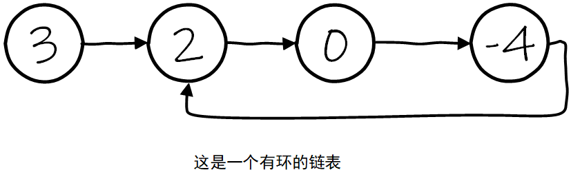
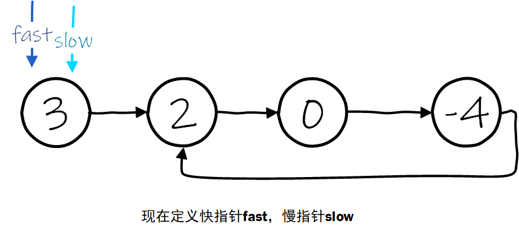
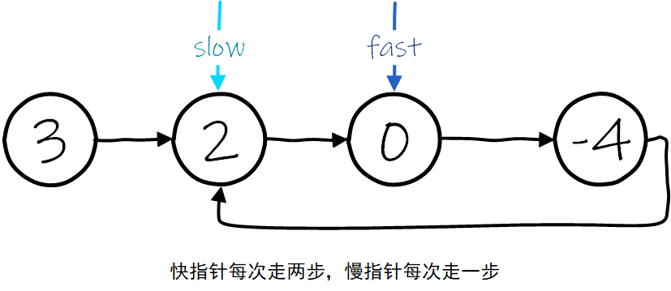
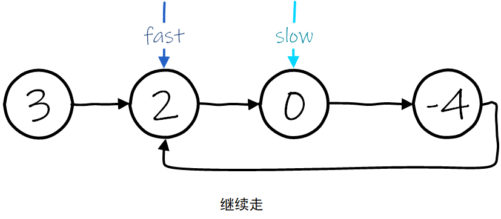
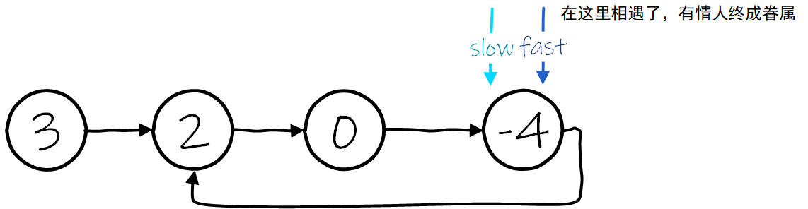

# 141. 环形链表

# 一、题目描述

```text
https://leetcode.cn/problems/linked-list-cycle/description/
```


给你一个链表的头节点 `head` ，判断链表中是否有环。

如果链表中有某个节点，可以通过连续跟踪 `next` 指针再次到达，则链表中存在环。 为了表示给定链表中的环，评测系统内部使用整数 `pos` 来表示链表尾连接到链表中的位置（索引从 0 开始）。**注意：`pos` 不作为参数进行传递** 。仅仅是为了标识链表的实际情况。

*如果链表中存在环* ，则返回 `true` 。 否则，返回 `false` 。

 

**示例 1：**


```
输入：head = [3,2,0,-4], pos = 1
输出：true
解释：链表中有一个环，其尾部连接到第二个节点。
```

**示例 2：**


```
输入：head = [1,2], pos = 0
输出：true
解释：链表中有一个环，其尾部连接到第一个节点。
```

**示例 3：**


```
输入：head = [1], pos = -1
输出：false
解释：链表中没有环。
```

 

**提示：**

- 链表中节点的数目范围是 `[0, 104]`
- `-105 <= Node.val <= 105`
- `pos` 为 `-1` 或者链表中的一个 **有效索引** 。

 

**进阶：**你能用 `O(1)`（即，常量）内存解决此问题吗？


# 二、思路

快慢指针。


这是一个有环的链表： 



现在我们定义两个指针用来遍历链表，一个快指针fast，每次往前走两步，慢指针slow，每次往前走一步，初始情况下它们都指向链表的第一个元素：



现在开始往前走，fast指针走两步，从3走到0，slow指针走一步，从3走到2： 



继续走：



然后fast和slow指针相遇了：




# 三、AC代码

先他妈map一把梭，过一次再说

```go
/**
 * Definition for singly-linked list.
 * type ListNode struct {
 *     Val int
 *     Next *ListNode
 * }
 */
func hasCycle(head *ListNode) bool {
// 管他妈，先来个map一把梭 
m := make(map[*ListNode]struct{}, 0)
for head != nil {
if _, exists := m[head]; exists {
return true
}
m[head] = struct{}{}
head = head.Next
}
return false
}
```

快慢指针，有情人终会相遇：

```go
/**
 * Definition for singly-linked list.
 * type ListNode struct {
 *     Val int
 *     Next *ListNode
 * }
 */
func hasCycle(head *ListNode) bool {
    fast := head 
    slow := head 
    for slow != nil && fast != nil { 
        fast = fast.Next 
        if fast == nil {
            return false 
        } else if fast == slow {
            return true 
        }
        fast = fast.Next
        if fast == nil {
            return false 
        } else if fast == slow {
            return true 
        }
        slow = slow.Next
    }
    return false 
}
```

